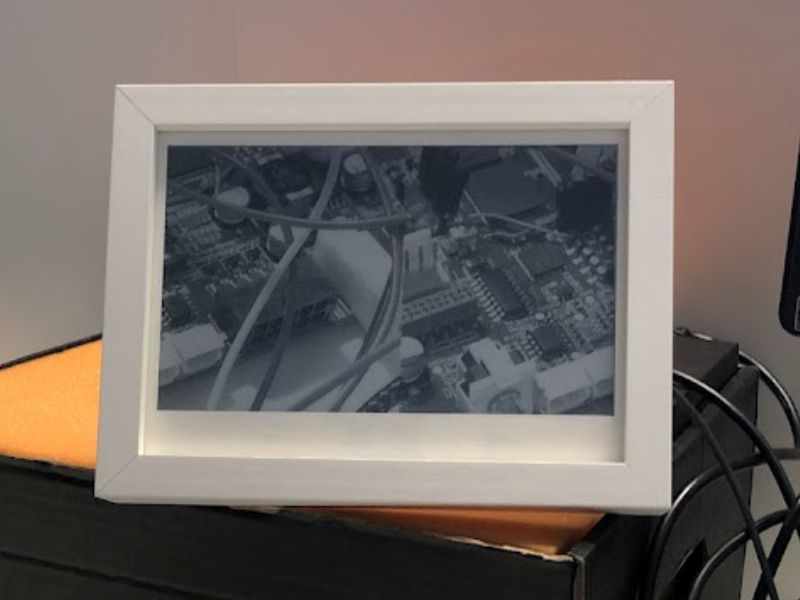

# E-Paper Frame 🖥️

Frame to show now to frequently changing information. Now it is used to serve AP with web server for responsive web page. The web page is combined HTML, CSS, JS and images and is used to crop, scale, process and upload image to the frame.

Watch this ▶️ [YT Short](https://youtube.com/shorts/pKEM7Uka-vU?si=n88JxDTBIQ4Fu2NL) 🔥 to see how it works.

  

## BOM 🛠️

The frame is built around [ESP32 Rustboard](https://github.com/esp-rs/esp-rust-board) (and yea, written in C). The Rustboard has:
- ESP32-C3,
- Lipol charger circuit, 
- USB C, 
- SHTC3 temperature/humidity sensor,
- ICM-42670-P IMU

Despite that:
- LiPol battery,
- Waveshare 7.5' monochrome E-ink display,
- Touch button,
- WS2812B LED.

## Development 📲

Inside - it is hobby project, made out of easly forming pieces of wooden strip, plywood and MDF board.

  

During development only USB-C connection is needed. Code is written in VS Code with official ESP32 plugin. BTW the plugin is awesome! ⭐

  

Credentials are needed to connect to the frame and control using web portal.

The web page is made using CSS responsive style from [W3Schols](https://www.w3schools.com/) examples. JS is mostly image processing with Floyd–Steinberg Dithering Algorithm and some color manipulation.

  

Finally input is converted to BMP monochrome file and sent to POST endpoint. During dev the BMP file is downloaded, for example the first image which then was sent to the frame:

  

## Schematic 📋

TBH it is very simple. Just connect SPI, button, and use I2C devices.

Recentrly battery monitor was added to GPIO0. It is actually 2x 100k voltage divider with capacitor at output to help ADC measurements.

## Plans ✔️

Todo:
- [ ] Add calendar
- [ ] Add weather info
- [ ] Use already included IMU sensor to rotate screen.
